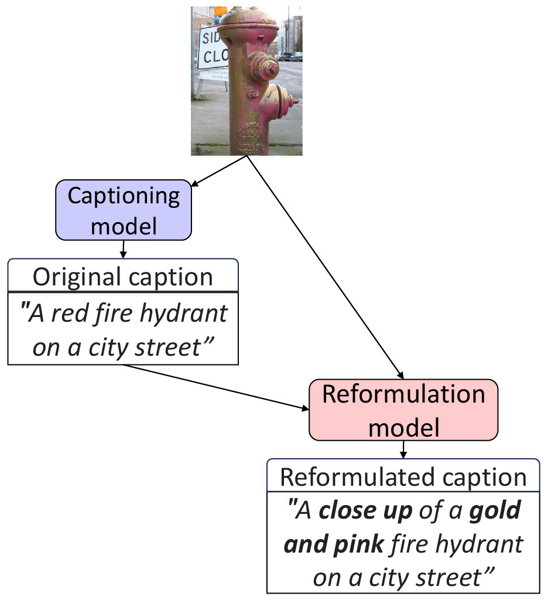

# Image Captioning using Reformulations

The code in this repository is based on the original [mPLUG repository](https://github.com/alibaba/AliceMind/tree/main/mPLUG).

## Introduction



We propose an inference-time feedback model for the task of image captioning with a novel type of feedback, namely reformulation.
In the context of this type of feedback, the human annotators receive an image and a textual description as input, and subsequently produce text that is as similar as possible to the input text but also incorporates an additional desired attribute (e.g., improved factuality or a desired style). The reformulation model is trained to predict human reformulations.

## Installation
```
pip install -r requirements.txt
```

## Training
If you want to train your own reformulation model:
1. Download the mPLUG model from the original [repo](https://github.com/alibaba/AliceMind/tree/main/mPLUG).
2. Prepare a reformulation dataset in json format, i.e., a list of dictionaries, each with the following fields:
   - question_id: Any unique id
   - image: Path to image
   - question: Original caption
   - Answer: Reformulated caption
3. Modify the 'train_file' field in the relevant config file (configs/re_mplug_base.yaml or configs/re_mplug_large.yaml).
4. Train, e.g.:
```
bash scripts/re_mplug_base.sh 
```
Or:
```
bash scripts/re_mplug_large.sh 
```

We provide 3 reformulation datasets in this repository:
1. An error-correction reformulation data containing 5208 collected using Amazon Mechanical Turk (data/error_correction_dataset.json).
2. A style-transfer reformulation data transfering to humorous captions, harvested from FlickrStyle and the original Flickr30K captions (data/humor_train.json and data/humor_test.json).
3. A style-transfer reformulation data transfering to romantic captions, harvested from FlickrStyle and the original Flickr30K captions (data/romantic_train.json and data/romantic_test.json).

## Reformulate
To reformulate existing captions, create a json file containing a list of dictionaries, each with the following fields:
- caption: The caption to be reformulated
- image_path: Path to relevant image

Train your own reformulation model or download one of our provided models:

- [Error correction reformulation model](https://drive.google.com/drive/folders/1POjbnc7f3fHtve3y8wqQQvd-hQ-DwHhA?usp=sharing) (mPLUG base)
- [Humor style-transfer reformulation model](https://drive.google.com/file/d/1Un85hb6mdCjMA6cilfXUcwtaf29uyf25/view?usp=sharing) (mPLUG large)
- [Romantic style-transfer reformulation model](https://drive.google.com/file/d/1TThQIYb0G8PFut-fYGRV2WUkmfzfgjGd/view?usp=sharing) (mPLUG large)

Then, use the reformulate.py script.:
```
python reformulate.py --model_path <path to reformulation model> --mplug_backbone <base/large> --input_file <path to input json file> --output_file <path to output file, json format>
```
